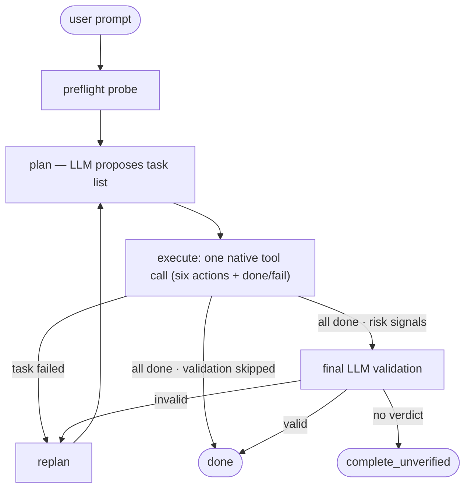

# AskMe

[](https://github.com/den-run-ai/askme/actions/workflows/ci.yml?query=branch%3Amain)
[](https://app.codecov.io/gh/den-run-ai/askme)
[](https://github.com/den-run-ai/askme/actions/workflows/llm.yml?query=branch%3Amain)

AskMe began with a simple dream: a small open model on my MacBook, through
`llama.cpp`, helping with real coding work anywhere—even on a plane without
Wi-Fi. This repository is a progress report toward that fully local coding
agent.

The project explores whether a tight, minimal harness can make small models
more useful: keep context lean, ask for one structured action at a time,
execute it, return fresh evidence, preserve completed work, and repair locally
before replanning broadly. The goal is not to lower the standard for small
models, but to judge delivered behavior—and to evaluate the model, harness,
task, and evaluator as one system.

I presented this motivation, the design bets, early evidence, and remaining
gaps in [*Are Small LLMs Ready for Coding
Agents?*](talks/berkeley-agentic-ai-summit-2026/README.md), a five-minute
lightning talk at the 2026 Agentic AI Summit at UC Berkeley
([slides](talks/berkeley-agentic-ai-summit-2026/slides.pdf),
[recording](https://www.youtube.com/watch?v=N1XoiJGyNpM),
[corrected speaker script](talks/berkeley-agentic-ai-summit-2026/SPEAKER_NOTES.md),
[published-deck errata](talks/berkeley-agentic-ai-summit-2026/README.md#published-talk-errata--2026-09-07)).
The current answer is deliberately cautious: bounded loops look promising,
but realistic feature readiness remains open.

Today, AskMe is a small Python agent with no frameworks and no dependencies
beyond `requests`: `askme.py` keeps the CLI and compatibility API, `loop.py`
owns planning and controller sequencing, `state.py` owns shared run state
and the single step recorder, `llm.py` owns provider
calls and response decoding, `policies.py` owns step,
write-obligation and completion decisions, and `actions.py` owns the
action registry and handlers. It takes a prompt, plans tasks, executes them via
shell/write/edit/read/search/tree actions, and replans on failure. Its
capability-budget selection is provider/backend-independent by default; a
named legacy profile preserves the original Gemma 4 E4B/M1 setup, and the
runtime remains configurable for local servers and OpenRouter.

## Quick Start

AskMe is **source-only: clone and run**, not an installable pip CLI package.
With Python 3.10+ (including pip) and a [local model](docs/gemma4-setup.md)
ready, install the exact uv version required by `pyproject.toml`; uv creates
the environment from the committed lockfile:

```bash
python3 -m pip install uv==0.12.1
git clone https://github.com/den-run-ai/askme.git
cd askme
uv run --locked --no-dev askme.py --help
uv run --locked --no-dev askme.py --working-dir /path/to/project "Fix the failing tests"
```

Replace `/path/to/project` with a project you can safely edit: `--help` prints
the CLI options without calling a model, and a completed run prints
`All tasks complete.` with its output directory (completion is not independent
test acceptance). For OpenRouter or other options, see
[configuration](docs/configuration.md).

### Local llama.cpp setup

The local backend expects `llama-server` on `:8080`. The explicit
`legacy-e4b-m1-16k-v1` reference deployment (2026-08-03, 16 GB M1) uses
**Gemma 4 E4B QAT Q4_0** (official post-refresh
weights, ~5.15 GB) on llama.cpp build 9618+, launched with q4_0 KV cache,
`--swa-full --cache-reuse 256` (prompt caching), and `--reasoning off` —
required, or template auto-detection silently drains action budgets into
reasoning. MTP speculative decoding stays off (currently a small loss on M1).

```bash
./build/bin/llama-server \
  -m models/gemma4-e4b-qat/gemma-4-E4B_q4_0-it.gguf \
  -ngl 99 --ctx-size 16384 --flash-attn on \
  --cache-type-k q4_0 --cache-type-v q4_0 \
  --swa-full --cache-reuse 256 --reasoning off \
  -np 1 --alias gemma-4-e4b --port 8080
```

Run that deployment with its matching immutable profile:

```bash
LLM_MODEL=gemma-4-e4b \
LLM_CAPABILITY_PROFILE=legacy-e4b-m1-16k-v1 \
uv run --locked --no-dev askme.py --working-dir /path/to/project "Fix the failing tests"
```

`llama-server --reasoning off` controls server-side template parsing; it is
separate from AskMe's `AGENT_REASONING_POLICY`, whose default remains `gated`.

Full model/build/flag rationale and benchmark history:
[gemma4-setup.md](docs/gemma4-setup.md), [PERFORMANCE.md](docs/PERFORMANCE.md).

### Supported surfaces

- **CLI** — `python3 askme.py [prompt] [--prompt-file F] [--working-dir D]
  [--result-json R] [--reasoning-policy P] [--capability-profile P]
  [--max-replans/--max-tasks/--max-steps N]
  [--goal-context-chars N]`; exit code `0` exactly when the run completes.
- **Python API** — `run_result(prompt, working_dir=None, config=None,
  dependencies=None)` returns the structured result (`status`, `state`, `log`,
  credential-free `config` metadata, and the `workspace` ownership record);
  `RunConfig` pins immutable per-run settings and `RunDependencies` injects the
  LLM client, action executor, clock, and log/event sinks. `run(...) -> bool`,
  `ask_llm(...)`, and `execute(...)` remain compatibility surfaces.

## How It Works



Before planning, the agent probes the environment (platform, available tools,
package managers). The LLM breaks your prompt into tasks and executes each one
step-by-step, replanning on failure — a run gets up to three planning attempts.
A conditional LLM validator may review tentative completion; when the wanted
validator produces no verdict, the run completes with the typed
`complete_unverified` status instead of claiming a verified pass. By
default AskMe instructs the model not to install software;
`ALLOW_SYSTEM_INSTALLS=1` relaxes that instruction. Both are prompt policies,
not host-level enforcement.

Loop design, state model, action model, and current constraints:
[docs/ARCHITECTURE.md](docs/ARCHITECTURE.md).

## Security

AskMe is experimental automation, **not a sandbox**. It executes model-generated
shell commands with the current user's host permissions, and the policy env vars
are prompt-visible signals, not security boundaries. Run untrusted prompts or
repositories only in a disposable container or VM. See
[docs/SECURITY.md](docs/SECURITY.md) for the threat boundary and safe-use
guidance.

## Configuration

The everyday knobs:

| Env var | Default | Purpose |
|---|---|---|
| `LLM_BACKEND` | `local` | `local` or `openrouter` |
| `LLM_MODEL` | `local-model` | Requested local model/alias |
| `LLM_CAPABILITY_PROFILE` | `generic-feature-scale-v1` | Immutable model-facing budgets; select `legacy-e4b-m1-16k-v1` explicitly for the M1/E4B reference |
| `OPENROUTER_API_KEY` | (from `.env`) | API key for OpenRouter |
| `ALLOW_SYSTEM_INSTALLS` | `0` | Prompt-visible install policy; does not enforce host isolation |
| `AGENT_FINAL_VALIDATE` | `auto` | Final validation: `auto`, `always`, or `0` (disabled) |

Advanced configuration — OpenRouter model/provider routing, reasoning policy,
baseline reasoning effort for always-on reasoners (e.g. `openai/gpt-oss-20b`),
run logging, context budgets, and the automation/evaluation CLI — lives in
[docs/configuration.md](docs/configuration.md).

## Tests

```bash
# Create the locked development environment
uv sync --locked

# Fast local quality checks
uv run --locked ruff check *.py tests
uv run --locked ruff format --check *.py tests
uv run --locked ty check

# Deterministic suite (live LLM tests are opt-in and skip by default)
uv run --locked pytest tests/ -q

# CI-equivalent, branch-aware coverage gate
uv run --locked pytest tests/ --cov --cov-report=term-missing --cov-report=xml:coverage.xml

# Integration — local (requires llama-server on :8080)
ASKME_RUN_LIVE_LLM_TESTS=1 uv run --locked pytest tests/test_agent_integration.py -s -v -m live_llm -k "TestIntegration and not Medium and not Hard"
ASKME_RUN_LIVE_LLM_TESTS=1 uv run --locked pytest tests/test_agent_integration.py -s -v -m live_llm -k "IntegrationMedium"
ASKME_RUN_LIVE_LLM_TESTS=1 uv run --locked pytest tests/test_agent_integration.py -s -v -m live_llm -k "IntegrationHard"

# Integration — OpenRouter (requires OPENROUTER_API_KEY in .env)
ASKME_RUN_LIVE_LLM_TESTS=1 uv run --locked pytest tests/test_agent_integration.py -s -v -m live_llm -k "TestOpenRouterEasy or TestOpenRouterMedium or TestOpenRouterHard"

# Integration — showcase web-app tasks (docs/showcase-tasks.md)
ASKME_RUN_LIVE_LLM_TESTS=1 uv run --locked pytest tests/test_agent_integration.py -s -v -m live_llm -k "TestWebLocal"
ASKME_RUN_LIVE_LLM_TESTS=1 uv run --locked pytest tests/test_agent_integration.py -s -v -m live_llm -k "TestOpenRouterWeb"

# Multi-trial benchmark harness (reports median + range across N trials)
uv run --locked python tests/bench_harness.py --list
uv run --locked python tests/bench_harness.py \
  --model gemma-4-e4b \
  --capability-profile legacy-e4b-m1-16k-v1 \
  --expected-served-model gemma-4-e4b

# Native semantic-workflow qualification (offline; no model call)
uv run --locked pytest \
  tests/test_workflow_eval.py tests/test_workflow_alternatives.py -q
uv run --locked python tests/workflow_eval.py \
  tests/workflows/config_precedence/manifest.json --agent noop
```

Live integration tests require `ASKME_RUN_LIVE_LLM_TESTS=1` and skip when their
server or credential is unavailable. Ordinary test and coverage commands never
opt into paid model calls. Dated run matrices and suite-size snapshots live in
[docs/PERFORMANCE.md](docs/PERFORMANCE.md).

The README coverage badge shows Codecov's latest `main` percentage to two
decimal places and opens the detailed report. The Python 3.14 CI run also writes
coverage.py's exact branch-aware table to the GitHub job summary and stores
browsable HTML plus JSON/XML reports in the `coverage-python-3.14` artifact for
14 days. Codecov [counts partially covered lines as
misses](https://docs.codecov.com/docs/frequently-asked-questions#how-is-coverage-calculated),
so its badge can differ from coverage.py's execution-opportunity percentage
that enforces the 90% CI gate.

### LLM tests in CI

Two GitHub Actions workflows split hermetic from live-model testing:

- [`ci.yml`](.github/workflows/ci.yml) — locked uv environments, Ruff lint and
  formatting, ty type checking, Python 3.10–3.14 tests, and a 90% branch-aware
  coverage floor on every push/PR, with the Python 3.14 report published to
  GitHub and Codecov. It deliberately has no OpenRouter credential, so
  backend-gated suites auto-skip (guarded by `tests/test_ci_workflows_contract.py`).
- [`llm.yml`](.github/workflows/llm.yml) — OpenRouter-backed tests, using the
  repository's `Openrouter` deployment environment for `OPENROUTER_API_KEY`
  as an environment secret. The key is scoped only to preflight and live-model
  execution steps. Runs on push to `main` touching agent/test/dependency code,
  weekly on schedule, on manual dispatch (choose suite, smoke-model matrix,
  Berkeley models, provider, trials), and on pull requests only when labeled
  `llm-tests` — the job guard
  also requires the PR head branch to live in this repository, so labeled fork
  PRs are rejected before any credential is in scope.

`llm.yml` has three jobs. The smoke job runs an OpenRouter pytest suite (easy
by default) with automatic provider routing, once per model in the
`smoke_models` matrix. The dispatch-only `web-bench-trials` job (opt-in via a
nonzero `web_trials` input) benches every `web_models` × web-task cell that
many times through `tests/bench_harness.py` for median+range evidence. Web
cells use `requested=expected-served@effort` syntax and the immutable
`generic-feature-scale-v1` capability profile; an empty `web_models` input
inherits the `models` matrix. The legacy-named Berkeley job runs the same
hard-build and medium-repair selectors used by
[the talk's frozen eval protocol](talks/berkeley-agentic-ai-summit-2026/evals/README.md)
on current code and current model cells; it is not a replay of that historical
four-model, strict-SiliconFlow matrix. `tests/ci_llm_gate.py report` then
evaluates the smoke pass rule (every
trial: pytest pass and agent completion) and publishes a summary table. Because
a cell separately pins its requested model, immutable capability profile, and
exact expected served identity, requested/served-model/profile drift and
missing configuration hashes are evidence-integrity failures rather than model
outcomes. Provider drift is checked only when a provider is explicitly pinned. Since a
single unseeded live-model trial is not a reliability estimate, valid
Berkeley-cell outcome failures are advisory on post-merge `main` pushes;
malformed or missing evidence remains blocking, and scheduled, manual, and
opt-in PR runs remain strict. JSONL run logs, bounded pytest failure diagnostics,
and `summary.json` files are uploaded as artifacts. A
preflight step fails loudly when the key is missing or rejected, so a bad
credential can never produce a silently green (all-skipped) run. The full
default matrix measured about $0.01 in OpenRouter credits per run.

### macOS Apple Silicon CI

[`macos.yml`](.github/workflows/macos.yml) covers the platform the local
llama.cpp backend actually targets. It needs no credential — every lane talks
either to nothing at all or to a `llama-server` on localhost — and has three
lanes because they buy different things:

| Lane | Runner | Trigger | Gates? |
|---|---|---|---|
| `macos-tests` | `macos-26` (free) | push, PR | yes |
| `llama-contract` | `macos-26` (free) | push, PR, weekly | server preflight gates; model probe advisory |
| `llama-reference` | `${{ inputs.runner }}` | manual only | yes, including a runner-size floor |

`macos-tests` runs the deterministic suite on arm64 for Python 3.10 and 3.14 —
the ends of the supported range, since `ci.yml` already covers the middle on
Linux. This is the lane that catches genuine platform bugs: macOS resolves
`/tmp` and `/var` through symlinks into `/private`, and its default filesystem
is case-insensitive, both of which bear directly on workspace-path and
target-identity normalization.

`llama-contract` installs llama.cpp from Homebrew, serves a deliberately tiny
tool-capable model (Qwen3-0.6B), and checks the seam through the real
`LLMClient`. It exists to catch upstream llama.cpp drift breaking the local
backend. `tests/ci_local_gate.py preflight` gates: `tests/conftest.py` *skips*
local suites when `:8080` is absent, so without it a broken backend would read
as a green run. The `probe` step — one `expect="action"` round trip asserting
the tools payload is accepted and the envelope decodes — stays advisory,
because a 0.6B model on a 3-vCPU runner missing a tool call is evidence about
the model, not about AskMe.

`llama-reference` runs the documented reference model (Gemma 4 E4B QAT Q4_0,
5.15 GB) with the exact stable flags from [docs/gemma4-setup.md](docs/gemma4-setup.md).
It is manual-only and takes a runner label, because **no GitHub-hosted runner
matches the 16 GB reference machine**:

| Label | Chip | vCPU | RAM | Cost |
|---|---|---|---|---|
| `macos-26` | M1 | 3 | 7 GB | free/unlimited on public repos |
| `macos-26-xlarge` | M2 Pro | 5 | 14 GB | billed per-minute, org-owned repos only |
| `macos-26-large` | Intel | 12 | 30 GB | not Apple Silicon — no Metal |

14 GB is short of the reference 16 GB but still holds the model plus its 16K
q4_0 KV cache, so `macos-26-xlarge` is the default. For true 16 GB+ parity,
point `runner` at a third-party arm64 label (Depot, WarpBuild, Blaze, Bitrise)
or a self-hosted Tart/Tartelet runner — all are one-line swaps — and set
`min_memory_gb` to `16`. `tests/ci_local_gate.py hardware` then verifies the
machine really is that size *before* the multi-gigabyte download, so an
undersized runner fails fast instead of being OOM-killed mid-suite in a way
that looks like an agent-loop bug.

**These lanes are not performance evidence.** CI runners are smaller and slower
than the documented M1/16 GB reference deployment, and a run that clears a
lane's floor while sitting below 16 GB says so explicitly in its job summary.
Timings from this workflow must never be written into
[docs/PERFORMANCE.md](docs/PERFORMANCE.md) or cited as a local baseline; use the
reference machine for that.

## Files

- `askme.py` — CLI, environment/configuration wiring and backwards-compatible public API
- `loop.py` — planning, run configuration and controller sequencing
- `state.py` — shared run state, typed access over one live dictionary, and the single step recorder; leaf over action records
- `llm.py` — immutable provider settings, response codecs and injectable client
- `policies.py` — step strategies, incomplete-write obligations and completion/validation decisions through explicit contexts, with legacy adapters
- `actions.py` — canonical action registry, handlers and execution receipts
- `tests/` — unit and integration tests, split by concern
- `tests/bench_harness.py` — multi-trial benchmark harness
- `tests/ci_local_gate.py` — macOS/llama.cpp hardware, server, and transport gate
- `tests/workflow_eval.py` — manifest-driven native workflow evaluator
- `tests/workflows/` — versioned semantic fixtures and [evaluation protocol](tests/workflows/PROTOCOL.md)
- `tests/featurebench/` — FeatureBench adapter and [qualified canary runbook](tests/featurebench/README.md)
- [docs/ARCHITECTURE.md](docs/ARCHITECTURE.md) — loop design, state model, action model, current constraints
- [docs/configuration.md](docs/configuration.md) — full env var reference and automation CLI
- [docs/gemma4-setup.md](docs/gemma4-setup.md) — llama-server config, KV cache, model notes
- [docs/PERFORMANCE.md](docs/PERFORMANCE.md) — benchmark history and test-run matrices
- [docs/EXPERIMENTS.md](docs/EXPERIMENTS.md) — active experiment backlog
- [docs/SECURITY.md](docs/SECURITY.md) — threat boundary and safe-use guidance
- [CLAUDE.md](CLAUDE.md) — guidance for AI agents working in this directory
