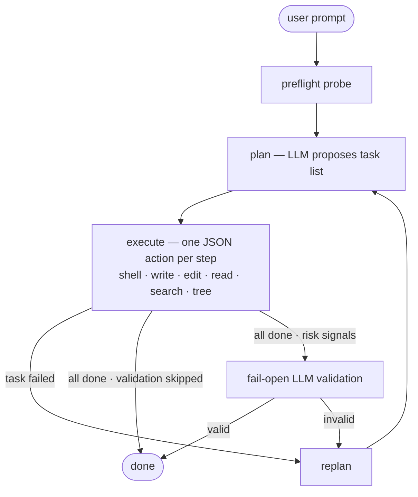

# AskMe

AskMe began with a simple dream: a small open model on my MacBook, through
`llama.cpp`, helping with real coding work anywhere—even on a plane without
Wi-Fi. This repository is a progress report toward that fully local coding
agent.

The project explores whether a tight, minimal harness can make small models
more useful: keep context lean, ask for one structured action at a time,
execute it, return fresh evidence, preserve completed work, and repair locally
before replanning broadly. The goal is not to lower the standard for small
models, but to judge delivered behavior—and to evaluate the model, harness,
task, and evaluator as one system.

I presented this motivation, the design bets, early evidence, and remaining
gaps in [*Are Small LLMs Ready for Coding
Agents?*](talks/berkeley-agentic-ai-summit-2026/README.md), a five-minute
lightning talk at the 2026 Agentic AI Summit at UC Berkeley
([slides](talks/berkeley-agentic-ai-summit-2026/slides.pdf),
[speaker script](talks/berkeley-agentic-ai-summit-2026/SPEAKER_NOTES.md)).
The current answer is deliberately cautious: bounded loops look promising,
but realistic feature readiness remains open.

Today, AskMe is a minimal, single-file Python agent with no frameworks and no
dependencies beyond `requests`. It takes a prompt, plans tasks, executes them
via shell/write/edit/read/search/tree actions, and replans on failure. It is
built for Gemma 4 E4B on `llama-server` and also supports OpenRouter.

## Quick Start

With Python 3.10+ and a [local model](docs/gemma4-setup.md) ready, install the
runtime dependency and run AskMe on a project you can safely edit:

```bash
python3 -m pip install -r requirements.txt
python3 askme.py --working-dir /path/to/project "Fix the failing tests"
```

For OpenRouter or other options, see [configuration](docs/configuration.md).

## How It Works



Before planning, the agent probes the environment (platform, available tools,
package managers). The LLM breaks your prompt into tasks and executes each one
step-by-step, replanning on failure — a run gets up to three planning attempts.
A conditional, fail-open LLM validator may review tentative completion. By
default AskMe instructs the model not to install software;
`ALLOW_SYSTEM_INSTALLS=1` relaxes that instruction. Both are prompt policies,
not host-level enforcement.

Loop design, state model, action model, and current constraints:
[docs/ARCHITECTURE.md](docs/ARCHITECTURE.md).

## Security

AskMe is experimental automation, **not a sandbox**. It executes model-generated
shell commands with the current user's host permissions, and the policy env vars
are prompt-visible signals, not security boundaries. Run untrusted prompts or
repositories only in a disposable container or VM. See
[docs/SECURITY.md](docs/SECURITY.md) for the threat boundary and safe-use
guidance.

## Configuration

The everyday knobs:

| Env var | Default | Purpose |
|---|---|---|
| `LLM_BACKEND` | `local` | `local` or `openrouter` |
| `OPENROUTER_API_KEY` | (from `.env`) | API key for OpenRouter |
| `ALLOW_SYSTEM_INSTALLS` | `0` | Prompt-visible install policy; does not enforce host isolation |
| `AGENT_FINAL_VALIDATE` | `auto` | Final validation: `auto`, `always`, or `0` (disabled) |

Advanced configuration — OpenRouter model/provider routing, reasoning policy,
baseline reasoning effort for always-on reasoners (e.g. `openai/gpt-oss-20b`),
run logging, context budgets, and the automation/evaluation CLI — lives in
[docs/configuration.md](docs/configuration.md).

## Tests

```bash
# Install pinned direct runtime and development dependencies
python3 -m pip install -r requirements-dev.txt

# Fast local quality checks
python3 -m ruff check askme.py tests
python3 -m mypy

# Deterministic suite (live LLM tests are opt-in and skip by default)
python3 -m pytest tests/ -q

# CI-equivalent, branch-aware coverage gate
python3 -m pytest tests/ --cov=askme --cov-report=term-missing --cov-report=xml

# Integration — local (requires llama-server on :8080)
ASKME_RUN_LIVE_LLM_TESTS=1 python3 -m pytest tests/test_agent_integration.py -s -v -m live_llm -k "TestIntegration and not Medium and not Hard"
ASKME_RUN_LIVE_LLM_TESTS=1 python3 -m pytest tests/test_agent_integration.py -s -v -m live_llm -k "IntegrationMedium"
ASKME_RUN_LIVE_LLM_TESTS=1 python3 -m pytest tests/test_agent_integration.py -s -v -m live_llm -k "IntegrationHard"

# Integration — OpenRouter (requires OPENROUTER_API_KEY in .env)
ASKME_RUN_LIVE_LLM_TESTS=1 python3 -m pytest tests/test_agent_integration.py -s -v -m live_llm -k "TestOpenRouterEasy or TestOpenRouterMedium or TestOpenRouterHard"

# Multi-trial benchmark harness (reports median + range across N trials)
python3 tests/bench_harness.py          # 3 trials, easy, local
python3 tests/bench_harness.py --list   # available tests; --help for suites, backends, model/provider pins

# Native semantic-workflow qualification (offline; no model call)
python3 -m pytest \
  tests/test_workflow_eval.py tests/test_workflow_alternatives.py -q
python3 tests/workflow_eval.py \
  tests/workflows/config_precedence/manifest.json --agent noop
```

Live integration tests require `ASKME_RUN_LIVE_LLM_TESTS=1` and skip when their
server or credential is unavailable. Ordinary test and coverage commands never
opt into paid model calls. Dated run matrices and suite-size snapshots live in
[docs/PERFORMANCE.md](docs/PERFORMANCE.md).

### LLM tests in CI

Two GitHub Actions workflows split hermetic from live-model testing:

- [`ci.yml`](.github/workflows/ci.yml) — Ruff, mypy, Python 3.10/3.14
  tests, and a 90% branch-aware coverage floor on every push/PR. It deliberately
  has no OpenRouter credential, so backend-gated suites auto-skip (guarded by
  `tests/test_ci_workflows_contract.py`).
- [`llm.yml`](.github/workflows/llm.yml) — OpenRouter-backed tests, using the
  repository's `Openrouter` deployment environment for `OPENROUTER_API_KEY`
  as an environment secret. The key is scoped only to preflight and live-model
  execution steps. Runs on push to `main` touching agent/test/dependency code,
  weekly on schedule, on manual dispatch (choose suite, models, provider,
  trials), and on pull requests only when labeled `llm-tests` — the job guard
  also requires the PR head branch to live in this repository, so labeled fork
  PRs are rejected before any credential is in scope.

`llm.yml` has two jobs. The smoke job runs an OpenRouter pytest suite (easy
by default) with automatic provider routing. The Berkeley job replays the two
protocol cells from
[the talk's eval protocol](talks/berkeley-agentic-ai-summit-2026/evals/README.md)
— hard build + medium repair — per model through `tests/bench_harness.py`,
then `tests/ci_llm_gate.py report` enforces the protocol pass rule (every
trial: pytest pass and agent completion) and publishes a summary table.
JSONL run logs and `summary.json` files are uploaded as artifacts. A
preflight step fails loudly when the key is missing or rejected, so a bad
credential can never produce a silently green (all-skipped) run. The full
default matrix measured about $0.01 in OpenRouter credits per run.

## Files

- `askme.py` — the agent
- `tests/` — unit and integration tests, split by concern
- `tests/bench_harness.py` — multi-trial benchmark harness
- `tests/workflow_eval.py` — manifest-driven native workflow evaluator
- `tests/workflows/` — versioned semantic fixtures and [evaluation protocol](tests/workflows/PROTOCOL.md)
- `tests/featurebench/` — FeatureBench adapter and [qualified canary runbook](tests/featurebench/README.md)
- [docs/ARCHITECTURE.md](docs/ARCHITECTURE.md) — loop design, state model, action model, current constraints
- [docs/configuration.md](docs/configuration.md) — full env var reference and automation CLI
- [docs/gemma4-setup.md](docs/gemma4-setup.md) — llama-server config, KV cache, model notes
- [docs/PERFORMANCE.md](docs/PERFORMANCE.md) — benchmark history and test-run matrices
- [docs/EXPERIMENTS.md](docs/EXPERIMENTS.md) — active experiment backlog
- [docs/SECURITY.md](docs/SECURITY.md) — threat boundary and safe-use guidance
- [CLAUDE.md](CLAUDE.md) — guidance for AI agents working in this directory

